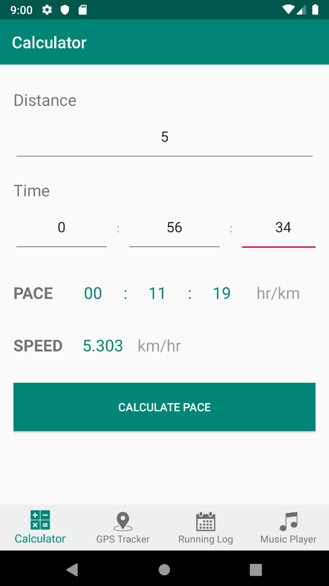
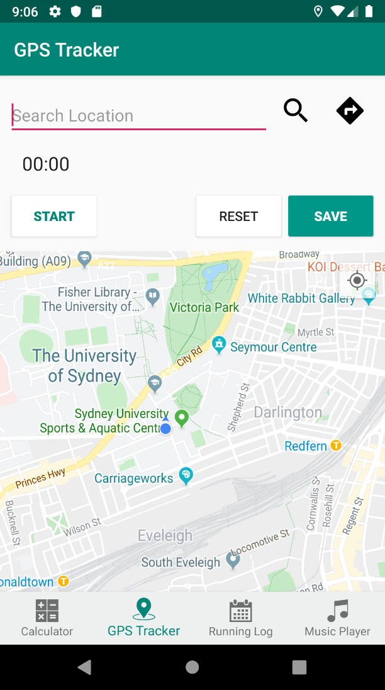
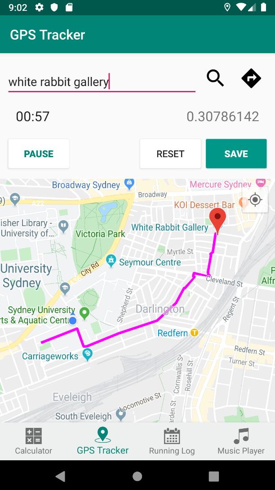
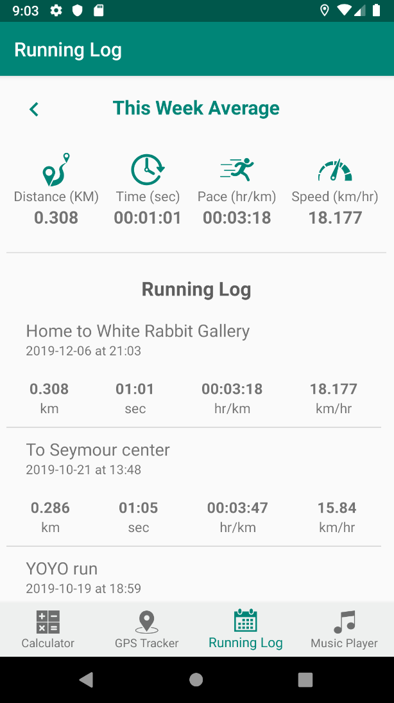
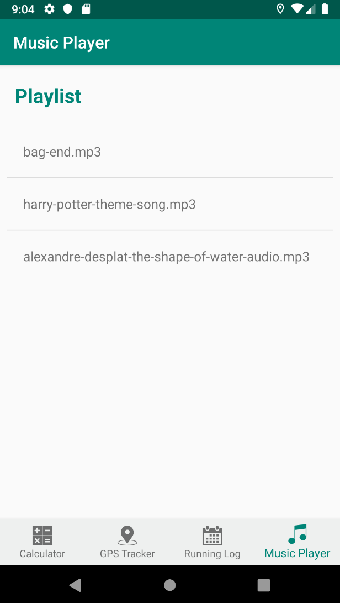
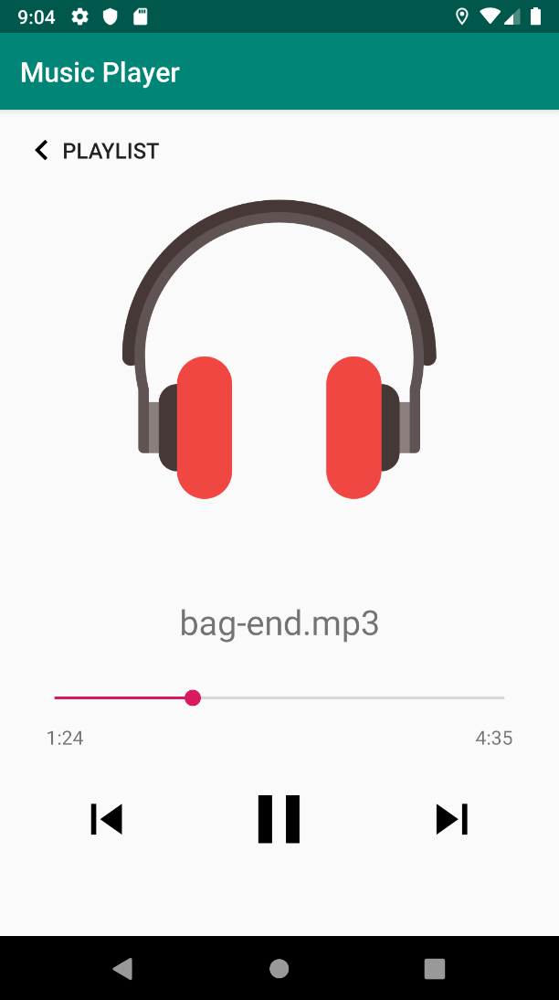

# Running Diary

An Android mobile application that serves as a running diary for the user to find a suitable running path to arrive at their desired destination, and record his/her running distance, time, speed, and location.

## Features

* Pace and Speed Calculator
* Search location and get running route
* GPS Tracking while running
* Record running time and distance
* Ability to start, pause, reset, and save the record
* Running logs
* Music player

### Pace & Speed Calculator

### GPS Tracker
Enter the destination, click search, and get direction. The route will then be displayed. User can tap Start to start the timer and the app will continuously calculate the distance traveled based on the previously collected location and current location of the user, accumulating the calculation of the distance in real-time. User can pause, resume, reset, or save the record to the running log with a title.

  

### Running Log
User can view all their recorded running logs and weekly average speed, distance, pace, and time of their runs.

### Music player
The app provides music player option for user to select songs from the device and play it while running or using the app.

 

## Prerequisites

* Android SDK v24
* Build tools version 29.0.2 or above
* Android Support Repository

## Setup

This project use Gradle build system.

1. Clone or download this repository
2. Import the project to Android Studio
3. Build and run
